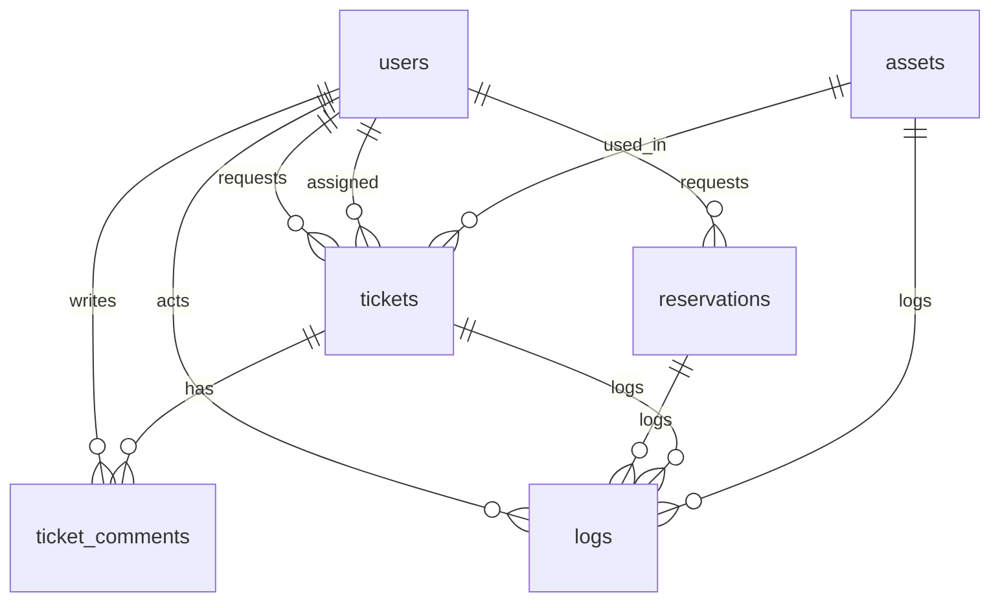

# Database ERD

Tabel utama:
* **users**: identitas, `name`, `email`, `password`, peran (RBAC)
* **assets**: inventaris perangkat, `asset_code`, `status`, `location`, `specs`.
* **tickets**: pengajuan layanan dengan `category`, `priority`, `status`, `requester_id`, `assignee_id`, `asset_id`.
* **reservations**: peminjaman ruang Zoom, `room_name`, `purpose`, `start_time`, `end_time`, `status`, `code`.
* **ticket_comments**: komentar per tiket, bisa internal.
* **logs**: catatan tindakan, polymorphic entitas.

Semua tabel di‑atas menggunakan `id` sebagai primary key. Foreign key di‑enforce via migration (sqlite/mysql/postgres).